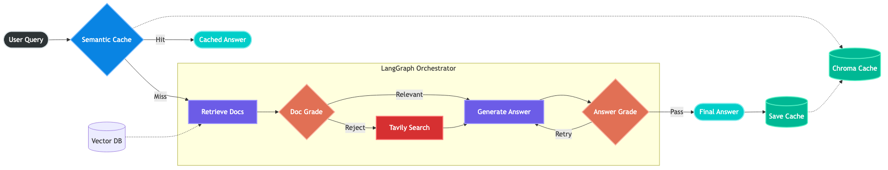
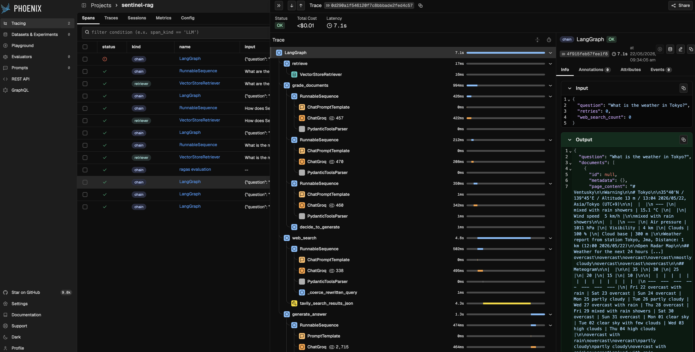

# SentinelRAG: Agentic AI Gateway


## 📌 Executive Summary

Standard "Naive RAG" pipelines suffer from three major enterprise roadblocks: they blindly trust retrieved context, they hallucinate when data is missing, and they are expensive/slow to run for duplicate queries.

**SentinelRAG** is a self-reflective, agentic orchestrator built to solve these exact pain points. By implementing active context grading, Corrective RAG (CRAG) web fallbacks, hallucination self-correction loops, and semantic caching, this system guarantees highly grounded answers while reducing API latency by over 99% for cached intents.

## Project Goals

* **Reliability:** Eliminate hallucinations by forcing the LLM to verify its own answers against retrieved facts.
* **Resilience:** Dynamically route out-of-domain queries to a live Web Search (Tavily) when local vector data is insufficient.
* **Performance:** Slash latency and LLM API costs by intercepting semantically similar queries via a Vector Cache layer.

---

## 🏗️ Architecture & Logic Flow

The core brain of SentinelRAG is modeled as a **State Machine** using `LangGraph`.



*Diagram source: [`docs/architecture_diagram.mmd`](docs/architecture_diagram.mmd)*

### Core Implementation Details:

1. **Semantic Cache Layer:** Intercepts incoming user queries. If a query semantically matches a previous question (Cosine Distance < 0.2), it returns the cached response, completely bypassing the LLM.
2. **Context Evaluator (Document Grader):** Uses structured Pydantic outputs to binary-score retrieved vector documents. If docs are irrelevant, they are actively **rejected**.
3. **Corrective Web Search (CRAG):** If all local documents are rejected, a Query Rewriter optimizes the prompt and triggers a Tavily API web search to fetch live data.
4. **Hallucination & Utility Graders:** Before returning an answer, the system checks if the generation is strictly grounded in the facts. If a hallucination is detected, it triggers a retry loop to self-correct.

---

## 📊 Performance & Results

### 1. Semantic Caching (Latency Optimization)

By utilizing a local ChromaDB cache, SentinelRAG drastically reduces response times for duplicate or rephrased queries.

* **Cache Miss (Agentic Flow):** ~2.04 seconds
* **Cache Hit (Semantic Match):** ~0.01 seconds *(99.5% latency reduction)*

```text
==================================================
[USER QUERY]: What is the primary purpose of Self-RAG?
==================================================
🐢 [LATENCY]: 2.0436 seconds 🐢  (Cache Miss - Triggered Agent)

==================================================
[USER QUERY]: What's the main goal of the Self-RAG framework?
==================================================
--- CHECKING CACHE FOR: 'What's the main goal of the Self-RAG framework?' ---
--- 🟢 CACHE HIT! (Distance: 0.2175) ---
⚡ [LATENCY]: 0.0104 seconds ⚡ (Semantic Cache Hit - Bypassed Agent)
```

### 2. Evaluation Metrics (Ragas)

Evaluated using the ragas framework to quantify generation quality across both in-domain (local vector) and out-of-domain (web fallback) queries. SentinelRAG achieved a perfect faithfulness score, proving the self-correction loop successfully prevents hallucinations.

| Question | Faithfulness (Groundedness) | Answer Relevancy |
| --- | --- | --- |
| What is the concept of Self-RAG? | 1.00 | 0.92 |
| How does Self-RAG handle hallucinations? | 1.00 | 0.97 |
| What is the weather in Tokyo? (Web Fallback) | 1.00 | 0.95 |
| Overall Mean Score | 1.00 | 0.954 |

## Observability & The "Reject Log"

To guarantee the agent is actually reasoning and not just parsing sequential code, the system is fully instrumented with Arize Phoenix.

Below is a visual trace of the LangGraph state machine. Notice the agent actively evaluating context, rejecting irrelevant documents, and dynamically pivoting to the web_search_tool.




## 🛠️ Tech Stack

* **Orchestration:** LangChain, LangGraph
* **LLMs:** Meta Llama-3-70B (via Groq API for ultra-fast inference)
* **Embeddings:** HuggingFace BAAI/bge-small-en-v1.5 (Local CPU)
* **Vector Store & Cache:** ChromaDB
* **Web Search Tool:** Tavily API
* **Observability:** Arize Phoenix
* **Evaluation:** Ragas

## How to Run Locally

This project is optimized to run entirely locally with free-tier APIs.

### 1. Setup Environment

Clone the repository and install dependencies:

```bash
git clone https://github.com/RamuNalla/sentinel-RAG.git
cd sentinel-RAG
python -m venv venv
source venv/bin/activate  # On Windows: venv\Scripts\activate
pip install -r requirements.txt
```

### 2. Configure API Keys

Create a `.env` file in the root directory:

```env
GROQ_API_KEY=your_groq_api_key_here
TAVILY_API_KEY=your_tavily_api_key_here
```

### 3. Ingest Data

Add your sample PDF to the `data/` folder (e.g., the Self-RAG research paper) and run the ingestion script to populate the local ChromaDB:

```bash
python src/data_ingestion.py
```

### 4. Run the Application

Launch the main gateway. This will boot up the Arize Phoenix tracing server and start the interactive terminal interface:

```bash
python src/main.py
```

To view the real-time execution trace, open http://127.0.0.1:6006 in your browser.

---

